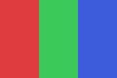
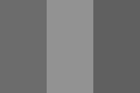
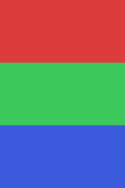
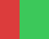
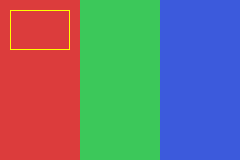
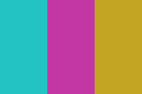

# Documentación del proceso de desarrollo — BmpEditor

## 1. Objetivo

Desarrollar una aplicación nativa que implemente funciones de **bajo
nivel** sobre un formato de imagen concreto: **editar archivos BMP**
manipulando directamente su encabezado binario y su matriz de píxeles, sin
apoyarse en bibliotecas de imágenes de alto nivel.

## 2. Selección de tecnología

| Decisión | Elección | Justificación |
|---|---|---|
| Lenguaje | C++17 | Control fino de memoria, bytes y aritmética de bits necesario para parsear un formato binario como BMP |
| Formato objetivo | BMP 24 bpp sin compresión (BI_RGB) | Formato simple, sin compresión, ideal para demostrar manejo de encabezados binarios, orden de bytes y padding — sin la complejidad de formatos comprimidos como PNG/JPEG |
| Sistema de build | CMake | Permite organizar el proyecto en biblioteca (`bmpeditor_lib`), CLI (`bmpedit`) y pruebas (`bmpeditor_tests`) como targets independientes y reproducibles |
| Control de versiones | Git | Herramienta vista en clase; se mantiene un historial de commits que documenta las etapas del desarrollo |

## 3. Retos técnicos de bajo nivel resueltos

### 3.1 Orden de canales B-G-R (no R-G-B)

La especificación de BMP almacena cada píxel como 3 bytes en orden
**Azul, Verde, Rojo**, al revés de lo que asume intuitivamente la mayoría
de la gente (RGB). Se implementó la conversión explícita en `load()` y
`save()` para exponer al resto del programa un modelo en memoria en orden
RGB (más intuitivo), aislando el detalle binario dentro de la capa de E/S.

**Bug detectado durante las pruebas**: al generar una imagen BMP sintética
de prueba con un script auxiliar, se escribieron los bytes de color
directamente en orden R-G-B (el orden "natural"), en lugar de B-G-R como
exige el formato. El resultado fue una imagen con los colores rojo y azul
intercambiados al abrirla. Esto confirmó, precisamente, que el programa
`bmpedit` **sí** interpreta correctamente el orden de canales según la
especificación (fue el script de prueba el que tenía el error, no el
editor) — se corrigió el script generador y se regeneraron las imágenes de
validación.

### 3.2 Orden de filas: bottom-up vs. top-down

BMP almacena las filas de la imagen **de abajo hacia arriba** cuando la
altura en el encabezado es positiva, y de arriba hacia abajo si es
negativa. `BmpImage::load()` detecta el signo de la altura y normaliza
siempre a una representación interna top-down (fila 0 = arriba), y
`BmpImage::save()` siempre escribe en formato bottom-up estándar
(máxima compatibilidad).

### 3.3 Padding de fila a múltiplos de 4 bytes

Cada fila de píxeles en el archivo debe ocupar un múltiplo de 4 bytes,
rellenando con bytes de relojen al final si es necesario
(`stride = ((width*3 + 3) / 4) * 4`). Se implementó la función
`row_stride()` y se verificó específicamente con una prueba unitaria usando
un ancho de imagen que **no** es múltiplo de 4 (37 píxeles → 111 bytes de
datos → 112 bytes con padding), confirmando que el redondeo y el descarte
del padding al leer funcionan correctamente.

## 4. Arquitectura

- **`BmpImage` (biblioteca)**: encapsula el formato de archivo y expone una
  API de alto nivel (`get`, `set`, `to_grayscale`, `crop`, etc.) que trabaja
  siempre sobre una matriz de píxeles RGB simple, sin que el resto del
  código deba preocuparse por bytes, padding u orden de canales.
- **`main.cpp` (CLI)**: interpreta los argumentos de línea de comandos y
  despacha a la operación correspondiente de `BmpImage`.
- **`test_bmp_image.cpp` (pruebas)**: 11 pruebas unitarias que cubren carga,
  guardado, round-trip (con y sin padding), y cada operación de edición.

## 5. Pruebas realizadas

Suite de 11 pruebas unitarias ejecutadas con `ctest`, todas exitosas:

```
[OK] round-trip guardar/cargar preserva los pixeles exactamente
[OK] round-trip con ancho no multiplo de 4 (padding de fila) funciona
[OK] grayscale iguala los 3 canales en cada pixel
[OK] invertir dos veces reproduce la imagen original
[OK] flip-h intercambia izquierda/derecha
[OK] rotate90 intercambia ancho/alto
[OK] rotar 180 dos veces reproduce la imagen original
[OK] crop produce las dimensiones esperadas
[OK] brightness satura en 255 sin desbordar
[OK] resize_nearest produce las dimensiones pedidas
[OK] cargar un archivo no-BMP lanza BmpError
```

### 5.1 Validación visual de extremo a extremo

Se generó una imagen BMP sintética de 240x160 con tres franjas de color
(rojo, verde, azul) y se aplicaron distintas operaciones del CLI,
verificando visualmente el resultado:

**Original:**



**`grayscale`** — escala de grises perceptual:



**`rotate90`** — las franjas verticales pasan a horizontales, preservando
el orden (rojo arriba, azul abajo), confirmando que la rotación es en el
sentido correcto:



**`crop 40 20 100 80`** — recorte de una región interna de la imagen:



**`rect 10 10 60 40 255 255 0 outline`** — rectángulo amarillo sin relleno
dibujado sobre la imagen original:



**`invert`** — inversión de colores (rojo→cian, verde→magenta, azul→amarillo):



## 6. Interfaz gráfica para Windows (extensión posterior)

A partir de la versión de consola ya probada, se agregó una interfaz
gráfica nativa para Windows (`src/gui_main.cpp`, target `bmpedit_gui`),
manteniendo la separación de capas ya establecida: **no se tocó la
biblioteca `bmpeditor_lib`** (salvo exponer `raw_rgb()` para acceso
eficiente al buffer de píxeles desde el renderizador), por lo que la GUI
reutiliza exactamente la misma lógica de bajo nivel ya cubierta por las 12
pruebas unitarias.

### Decisiones de diseño

- **Win32 puro (sin frameworks) en vez de MFC/WinForms/WPF**: mantiene el
  proyecto 100% C++ nativo y coherente con el resto del código (mismo
  lenguaje, mismo `CMakeLists.txt`, misma filosofía de "bajo nivel" del
  enunciado de la tarea).
- **Renderizado con `StretchDIBits`**: se convierte el buffer interno de
  `BmpImage` (RGB, top-down, sin padding) al mismo formato binario exacto
  que usa un archivo `.bmp` en disco (BGR, bottom-up, con padding de fila) —
  es decir, se reutiliza el conocimiento ya documentado en
  `docs/FORMATO_BMP.md` también para el renderizado en pantalla, no solo
  para leer/escribir archivos.
- **Rueda de color HSV dibujada a mano**: se precomputa una vez con
  `SetPixel` en un bitmap de memoria (ángulo → tono, distancia al centro →
  saturación), en vez de usar un control de terceros, siguiendo el mismo
  enfoque "bajo nivel" del resto del proyecto.
- **Un único nivel de "Deshacer"**: se guarda una copia de la imagen tal
  como se cargó (`original`), igual que en el modo interactivo de consola,
  en vez de una pila de historial completa — suficiente para el alcance de
  la tarea.
- **Separación por plataforma en CMake**: el nuevo target se agrega dentro
  de un bloque `if(WIN32)`, de forma que el build en Linux (usado durante
  el desarrollo y las pruebas automatizadas) sigue funcionando exactamente
  igual, sin intentar compilar código exclusivo de Windows.

### Limitación conocida de este documento

A diferencia del resto del proyecto, **esta parte no pudo compilarse ni
probarse en el entorno de desarrollo** (Linux, sin SDK de Windows
disponible). Se escribió siguiendo cuidadosamente los patrones estándar de
la API Win32 (registro de clases de ventana, `WM_PAINT`/`WM_COMMAND`/
`WM_LBUTTONDOWN`, cuadros de diálogo comunes `GetOpenFileNameW`/
`GetSaveFileNameW`, controles comunes con manifiesto para
`Microsoft.Windows.Common-Controls`), pero su compilación final y cualquier
ajuste fino solo pudieron validarse ya en Visual Studio, en Windows.

## 7. Resultados obtenidos

- Compilación exitosa con CMake y GCC 13 en modo `Release`, sin
  advertencias relevantes.
- 11/11 pruebas unitarias exitosas (`ctest` → 100% tests passed).
- Validación visual exitosa de las 5 operaciones principales sobre una
  imagen BMP real generada programáticamente.
- Manejo correcto de casos borde del formato: anchos no múltiplos de 4
  (padding), y archivos que no son BMP válidos (rechazo con mensaje claro).

## 8. Trabajo futuro / posibles extensiones

- Soporte para BMP de 8 bpp con paleta de colores (color indexado).
- Interpolación bilineal en `resize` (actualmente vecino más cercano).
- Operaciones adicionales: desenfoque (blur), detección de bordes (Sobel),
  dibujo de líneas y círculos.
- Interfaz gráfica simple (por ejemplo con SDL2) además del CLI actual.
